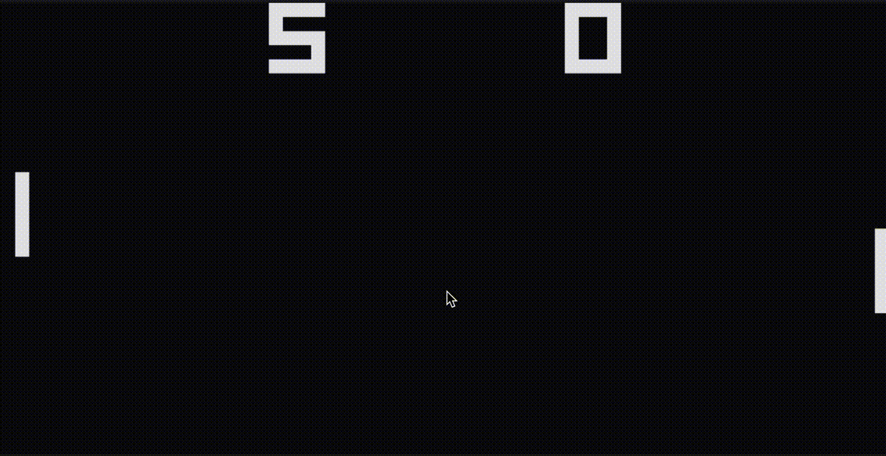

# Chip-8



A simple CHIP-8 emulator written in Rust and compiled to WebAssembly.

It passes all the test from [Timendus CHIP-8 test suite](https://github.com/Timendus/chip8-test-suite) and it works with PONG too.

> Why its flickering?

It's due to the way CHIP-8 handles the draw operation. It draws the sprites with XOR, so if a pixel is already on, it will be turned off. This is why the flickering happens.

> Lack of sound effects.

CHIP-8 doesnt have a good sound system, so I decided to not implement it.

## Usage

```bash
cd wasm/web
python3 -m http.server
```

Then open your browser at `http://localhost:8000/` and you should see the emulator running.

## Wasm build

In case you want to build the wasm module again, you can do it with the following commands:

```bash
cd wasm
wasm-pack build --target web
mv ./pkg/wasm_bg.wasm ./web
mv ./pkg/wasm.js ./web
```

### More info

Good reading:

- [Wikipedia Page](https://en.wikipedia.org/wiki/CHIP-8)
- [Write a CHIP-8 Emulator](https://tobiasvl.github.io/blog/write-a-chip-8-emulator/)
- [Matthew Mikolay CHIP-8 Technical Reference](https://github.com/mattmikolay/chip-8/wiki/CHIP%E2%80%908-Technical-Reference)
- [awesome-chip-8](https://github.com/tobiasvl/awesome-chip-8)
